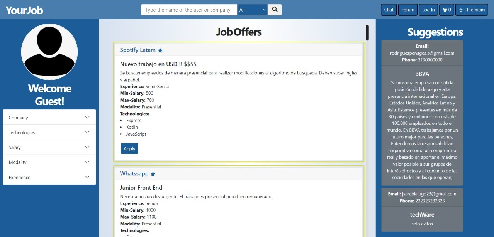
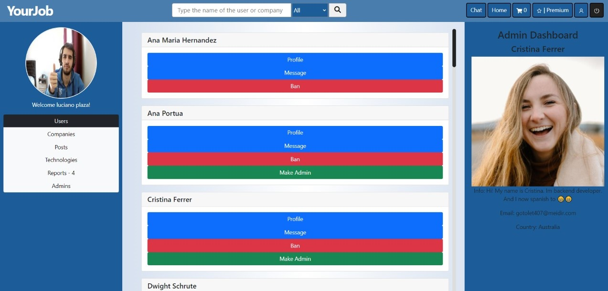
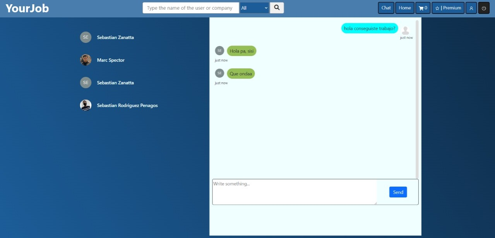
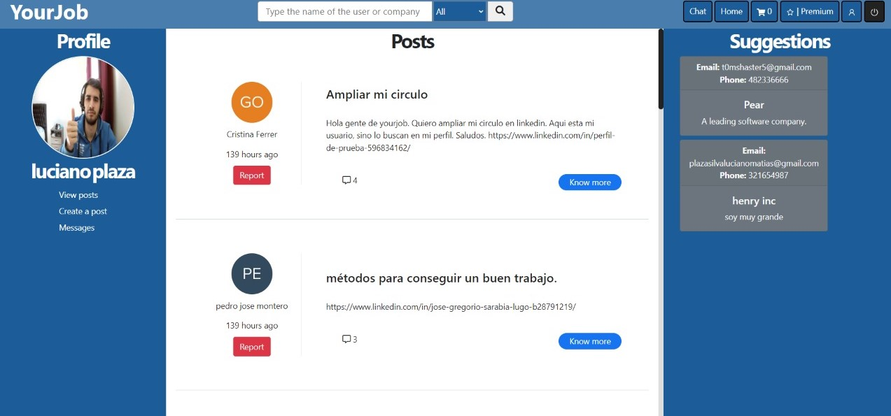
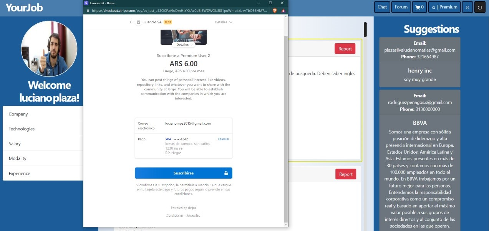
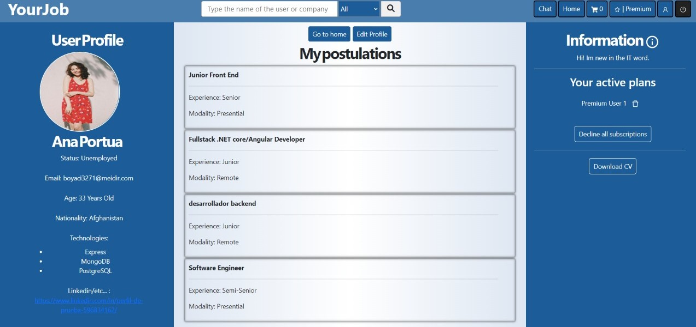
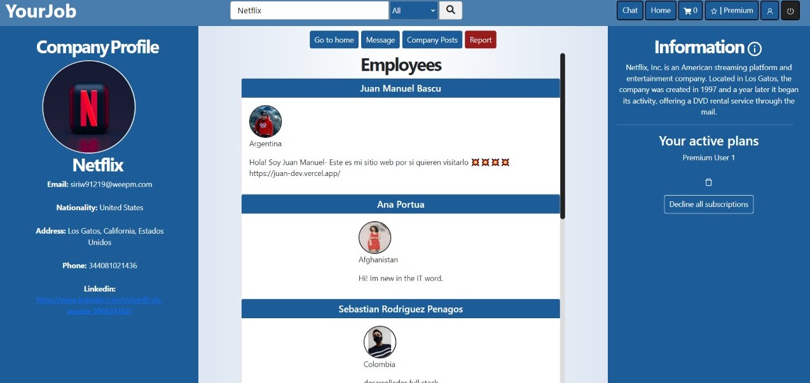

# :boy: ¿Who I am? :argentina:
:large_orange_diamond: Desarrollador Full Stack orientado al Back-End  pero adaptable a las necesidades del equipo, con la capacidad y proactividad para proyectos escalables y modularizados donde siempre se aprenda de los procesos y resultados.

## :man_student: ¿Why me?
:large_blue_diamond: De Henry Bootcamp a quien le debo mis conocimientos y ganas de un aprendizaje continuo; salimos con altas habilidades técnicas, con ganas de superarnos, impulsar nuestro entorno, complementar y orientar al equipo; tuve la oportunidad de liderar a un equipo en el proyecto final del cursado mejorando mis Soft Skills.

## :running_man: Work experience
- Trabajé en un bar asistiendo las necesidades de clientes, compañeros y superiores; de ahí saqué mi proactividad, resolución de problemas y coordinación.
- Trabajé en emprendimientos varios con amigos; de ahí saqué mi creatividad, perseverancia y pensamiento lógico.
- Trabajé como vendedor de productos para el hogar; de ahí saqué mi organización, comunicación y empatía.
- Actualmente estoy terminando el Bootcamp de Henry puliendo skills y profundizando mis conocimientos

## :rocket: My Projects
- Your Job
 

## :desktop_computer: Technologies
- Scrum
- NPM
- Backend
  - Node.js
  - Express
  - Sequelize
  - Postman
  - REST
- Database
  - PostgreSQL
  - SQL
- Frontend
  - React
  - Redux
  - HTML5
  - CSS3

### :telephone_receiver::email: __Contáctame:__
- __CEL:__ +54 3812061436
- __Gmail:__ lucianomps2015@gmail.com
